# BoBe Architecture Diagrams

> Visual architecture documentation using Mermaid diagrams

---

## 1. System Overview

### 1.1 High-Level Component Diagram

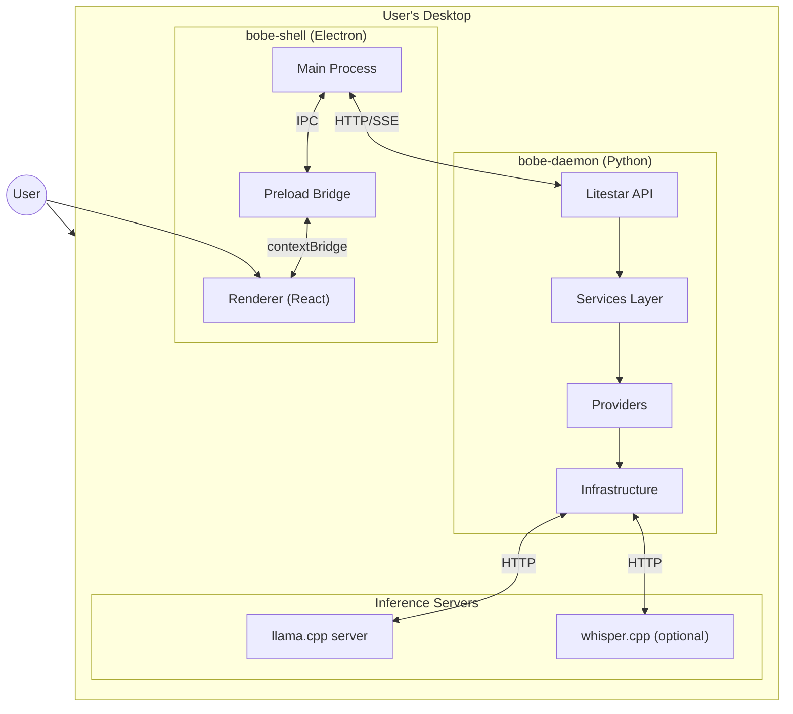
```mermaid
graph TB
    subgraph Desktop["User's Desktop"]
        subgraph Electron["bobe-shell (Electron)"]
            Main["Main Process"]
            Preload["Preload Bridge"]
            Renderer["Renderer (React)"]

            Main <-->|IPC| Preload
            Preload <-->|contextBridge| Renderer
        end

        subgraph Daemon["bobe-daemon (Python)"]
            API["Litestar API"]
            Services["Services Layer"]
            Providers["Providers"]
            Infra["Infrastructure"]

            API --> Services
            Services --> Providers
            Providers --> Infra
        end

        subgraph Inference["Inference Servers"]
            Llama["llama.cpp server"]
            Whisper["whisper.cpp (optional)"]
        end

        Main <-->|HTTP/SSE| API
        Infra <-->|HTTP| Llama
        Infra <-->|HTTP| Whisper
    end

    User((User)) --> Renderer
    User --> Desktop
```

### 1.2 Process Architecture

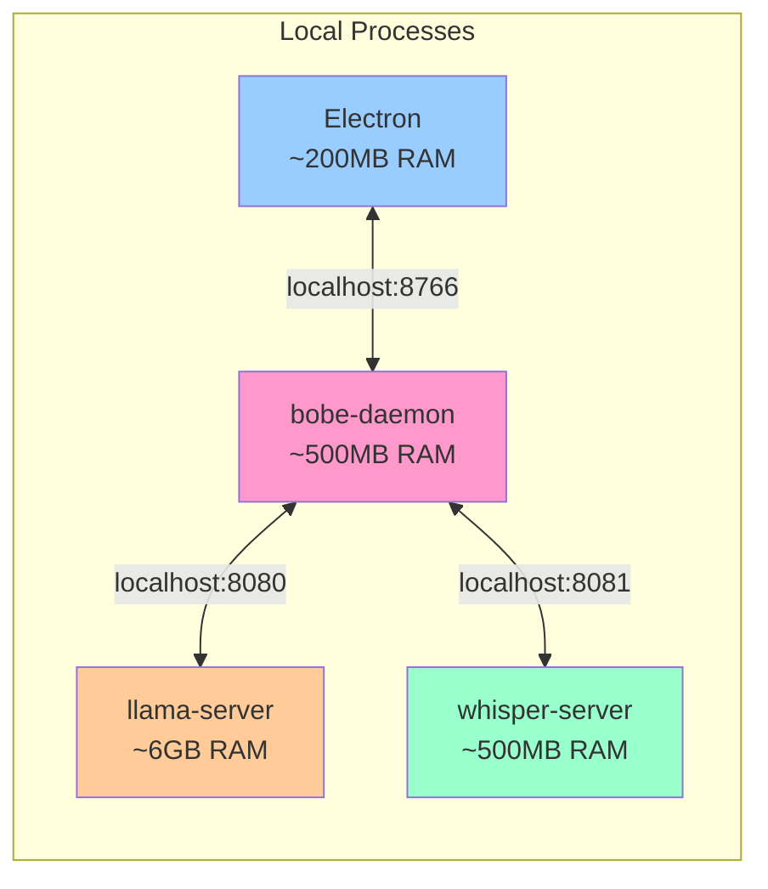
```mermaid
graph LR
    subgraph Processes["Local Processes"]
        E[Electron<br/>~200MB RAM]
        D[bobe-daemon<br/>~500MB RAM]
        L[llama-server<br/>~6GB RAM]
        W[whisper-server<br/>~500MB RAM]
    end

    E <-->|localhost:8766| D
    D <-->|localhost:8080| L
    D <-->|localhost:8081| W

    style E fill:#9cf
    style D fill:#f9c
    style L fill:#fc9
    style W fill:#9fc
```

---

## 2. Communication Architecture

### 2.1 Electron ↔ Daemon Communication

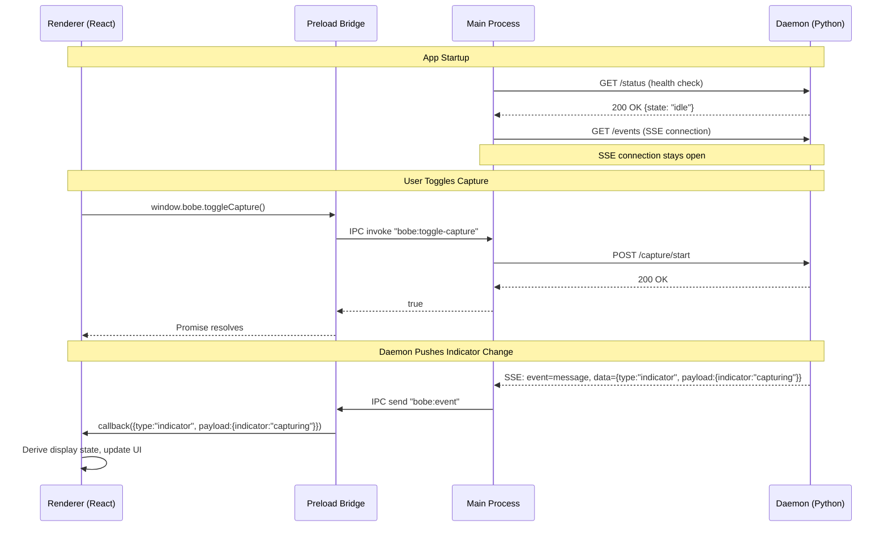
```mermaid
sequenceDiagram
    participant R as Renderer (React)
    participant P as Preload Bridge
    participant M as Main Process
    participant D as Daemon (Python)

    Note over R,D: App Startup
    M->>D: GET /status (health check)
    D-->>M: 200 OK {state: "idle"}
    M->>D: GET /events (SSE connection)
    Note over M,D: SSE connection stays open

    Note over R,D: User Toggles Capture
    R->>P: window.bobe.toggleCapture()
    P->>M: IPC invoke "bobe:toggle-capture"
    M->>D: POST /capture/start
    D-->>M: 200 OK
    M-->>P: true
    P-->>R: Promise resolves

    Note over R,D: Daemon Pushes Indicator Change
    D-->>M: SSE: event=message, data={type:"indicator", payload:{indicator:"capturing"}}
    M->>P: IPC send "bobe:event"
    P->>R: callback({type:"indicator", payload:{indicator:"capturing"}})
    R->>R: Derive display state, update UI
```

### 2.2 SSE Event Flow (The "2-Hour Push" Explained)

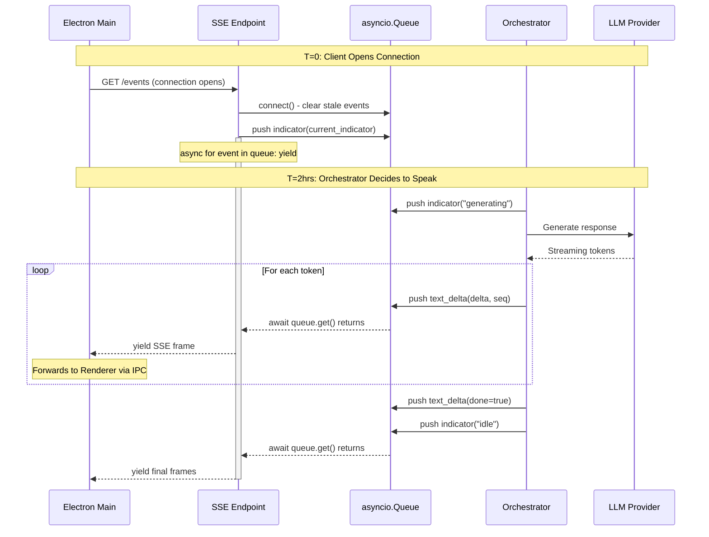
```mermaid
sequenceDiagram
    participant E as Electron Main
    participant SSE as SSE Endpoint
    participant Q as asyncio.Queue
    participant O as Orchestrator
    participant L as LLM Provider

    Note over E,L: T=0: Client Opens Connection
    E->>SSE: GET /events (connection opens)
    SSE->>Q: connect() - clear stale events
    SSE->>Q: push indicator(current_indicator)
    activate SSE
    Note over SSE: async for event in queue: yield

    Note over E,L: T=2hrs: Orchestrator Decides to Speak
    O->>Q: push indicator("generating")
    O->>L: Generate response
    L-->>O: Streaming tokens

    loop For each token
        O->>Q: push text_delta(delta, seq)
        Q-->>SSE: await queue.get() returns
        SSE-->>E: yield SSE frame
        Note over E: Forwards to Renderer via IPC
    end

    O->>Q: push text_delta(done=true)
    O->>Q: push indicator("idle")
    Q-->>SSE: await queue.get() returns
    SSE-->>E: yield final frames
    deactivate SSE
```

### 2.3 Why NOT WebSocket?

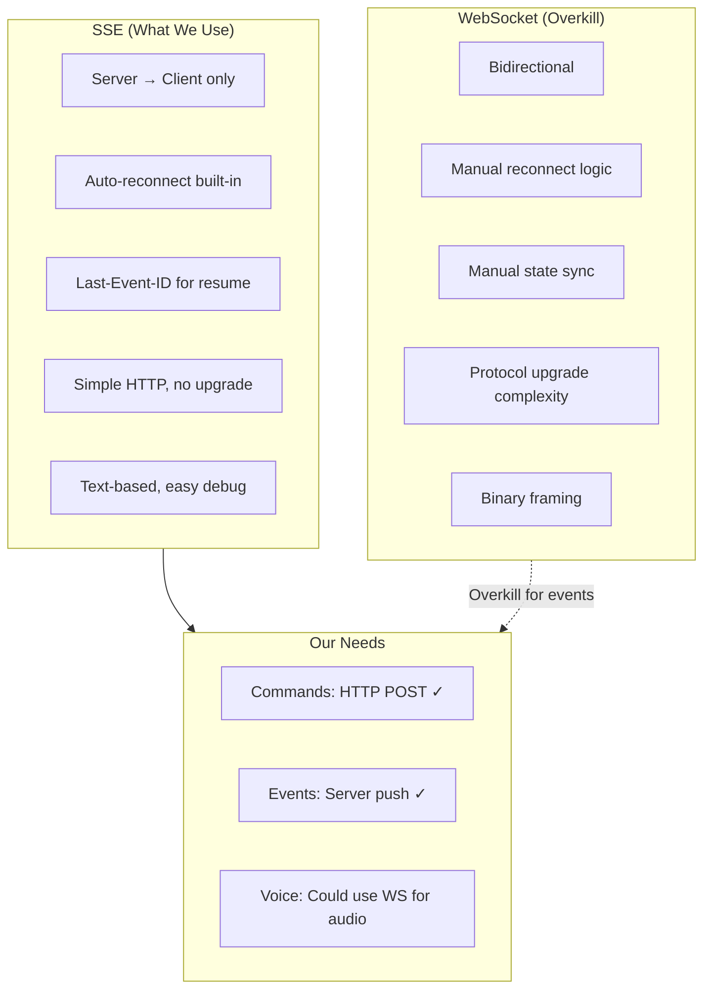
```mermaid
graph TB
    subgraph SSE["SSE (What We Use)"]
        SSE1[Server → Client only]
        SSE2[Auto-reconnect built-in]
        SSE3[Last-Event-ID for resume]
        SSE4[Simple HTTP, no upgrade]
        SSE5[Text-based, easy debug]
    end

    subgraph WS["WebSocket (Overkill)"]
        WS1[Bidirectional]
        WS2[Manual reconnect logic]
        WS3[Manual state sync]
        WS4[Protocol upgrade complexity]
        WS5[Binary framing]
    end

    subgraph Need["Our Needs"]
        N1[Commands: HTTP POST ✓]
        N2[Events: Server push ✓]
        N3[Voice: Could use WS for audio]
    end

    SSE --> Need
    WS -.->|Overkill for events| Need
```

---

## 3. Backend Architecture

### 3.1 Layered Architecture

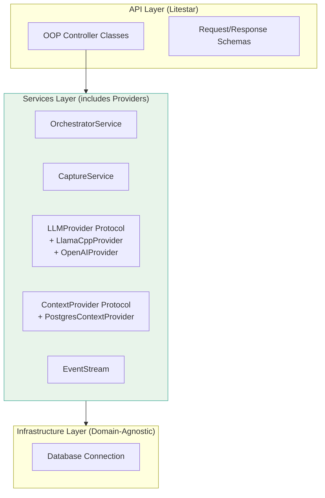
```mermaid
graph TB
    subgraph API["API Layer (Litestar)"]
        Controllers["OOP Controller Classes"]
        Schemas["Request/Response Schemas"]
    end

    subgraph Services["Services Layer (includes Providers)"]
        Orchestrator["OrchestratorService"]
        CaptureService["CaptureService"]
        LLMProviders["LLMProvider Protocol<br/>+ LlamaCppProvider<br/>+ OpenAIProvider"]
        ContextProvider["ContextProvider Protocol<br/>+ PostgresContextProvider"]
        StreamQueue["EventStream"]
    end

    subgraph Infra["Infrastructure Layer (Domain-Agnostic)"]
        DB["Database Connection"]
    end

    Controllers --> Services
    Services --> Infra

    style Services fill:#e8f4ea,stroke:#4a9
```

**Note:** Providers ARE services - they live in `services/`, not a separate `providers/` folder. Domain types live WITH their service (e.g., `services/llm_providers/models/`).

### 3.2 Provider Pattern

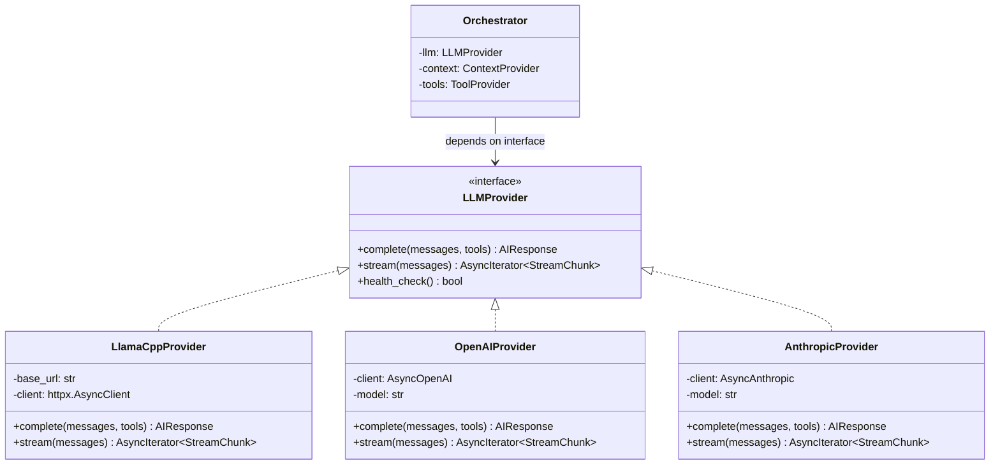
```mermaid
classDiagram
    class LLMProvider {
        <<interface>>
        +complete(messages, tools) AIResponse
        +stream(messages) AsyncIterator~StreamChunk~
        +health_check() bool
    }

    class LlamaCppProvider {
        -base_url: str
        -client: httpx.AsyncClient
        +complete(messages, tools) AIResponse
        +stream(messages) AsyncIterator~StreamChunk~
    }

    class OpenAIProvider {
        -client: AsyncOpenAI
        -model: str
        +complete(messages, tools) AIResponse
        +stream(messages) AsyncIterator~StreamChunk~
    }

    class AnthropicProvider {
        -client: AsyncAnthropic
        -model: str
        +complete(messages, tools) AIResponse
        +stream(messages) AsyncIterator~StreamChunk~
    }

    LLMProvider <|.. LlamaCppProvider
    LLMProvider <|.. OpenAIProvider
    LLMProvider <|.. AnthropicProvider

    class Orchestrator {
        -llm: LLMProvider
        -context: ContextProvider
        -tools: ToolProvider
    }

    Orchestrator --> LLMProvider : depends on interface
```

### 3.3 Folder Structure (Target)

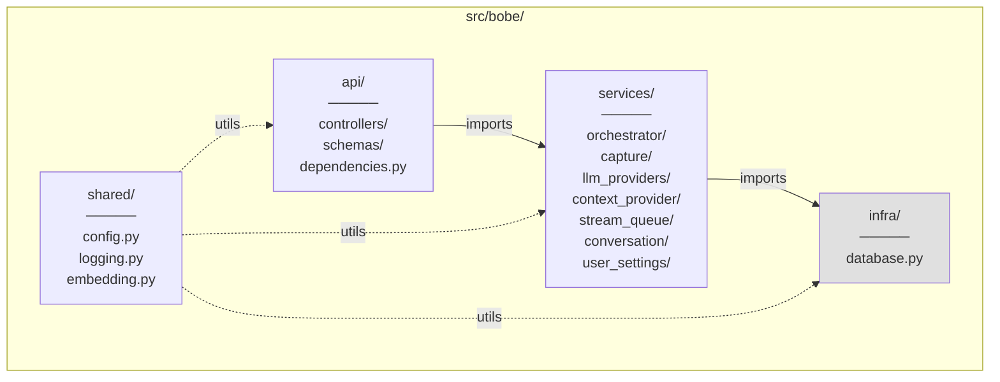
```mermaid
graph TB
    subgraph src["src/bobe/"]
        api["api/<br/>─────<br/>controllers/<br/>schemas/<br/>dependencies.py"]
        services["services/<br/>─────<br/>orchestrator/<br/>capture/<br/>llm_providers/<br/>context_provider/<br/>stream_queue/<br/>conversation/<br/>user_settings/"]
        infra["infra/<br/>─────<br/>database.py"]
        shared["shared/<br/>─────<br/>config.py<br/>logging.py<br/>embedding.py"]
    end

    api -->|imports| services
    services -->|imports| infra

    shared -.->|utils| api
    shared -.->|utils| services
    shared -.->|utils| infra

    style infra fill:#e0e0e0
```

### 3.4 Orchestrator Structure (Target)

```
services/orchestrator/
├── __init__.py
├── orchestrator_service.py     # Coordinator with _timer_loop(), _message_loop()
├── decision_engine.py          # Retrieval + LLM decision (flat, no folder)
├── response_generator.py       # Streaming response generation
└── types.py                    # Decision enum, OrchestratorConfig
```

**Note on triggers:** Currently using methods (`_timer_loop()`, `_message_loop()`) rather than a Trigger protocol. If we add more trigger types (calendar, email, etc.), extract a `Trigger` protocol then.

### 3.5 Context Provider & Learners Structure (Target)

```
services/context_provider/
├── __init__.py
├── protocols/
│   └── context_provider.py     # ContextProvider protocol (store, search_similar)
├── models/
│   └── context_item.py         # ContextItem ORM model
├── postgres_context_provider.py  # PostgreSQL implementation
│
└── learners/                   # Distillation strategies (experimental)
    ├── __init__.py
    ├── capture_learner.py      # Screenshot → Vision LLM → Context
    └── message_learner.py      # User message → Embed → Context
```

**Note on learners:** No formal `Learner` protocol needed yet — duck typing works. Add protocol if learner count grows or we need to mock them.

### 3.6 Embedding (Simplified)

Embedding generation lives in `shared/` as a simple function, not a provider:

```
shared/
├── config.py
├── logging.py
└── embedding.py    # embed(text) → list[float], uses Ollama /api/embed
```

Learners import and use `embed()` directly. No DI, no protocol.

**Why learners are in `context_provider/`:**

- Learners always store to ContextProvider (tightly coupled)
- Learning = distillation + storage (not separate concerns)
- Many learners → one ContextProvider
- Learners differ by HOW they distill, not WHERE they store

**Relationship:**

```
CaptureLearner ─────┐
                    │
MessageLearner ─────┼───▶ ContextProvider.store()
                    │
CalendarLearner ────┘
```

**Note:** There is NO separate `providers/` or `domain/` folder. Providers and domain types live WITH their service in `services/featurename/`.

---

## 4. Observation → Learning → Decision Model

> **Core Mental Model:** Observations from triggers become learning in the context store.
> Learning = distillation (trigger-specific LLM) + storage (always to ContextProvider).
> Retrieval = semantic search from ContextProvider.

### 4.1 Learning and Retrieval

**Learning** is the process of:

1. Taking raw input (screenshot, calendar event, user message)
2. Distilling via LLM (describe image, extract entities, summarize)
3. Packaging with metadata (timestamp, source, embedding)
4. Storing to ContextProvider

**Retrieval** is the inverse:

1. Semantic search in ContextProvider
2. Returns relevant past context

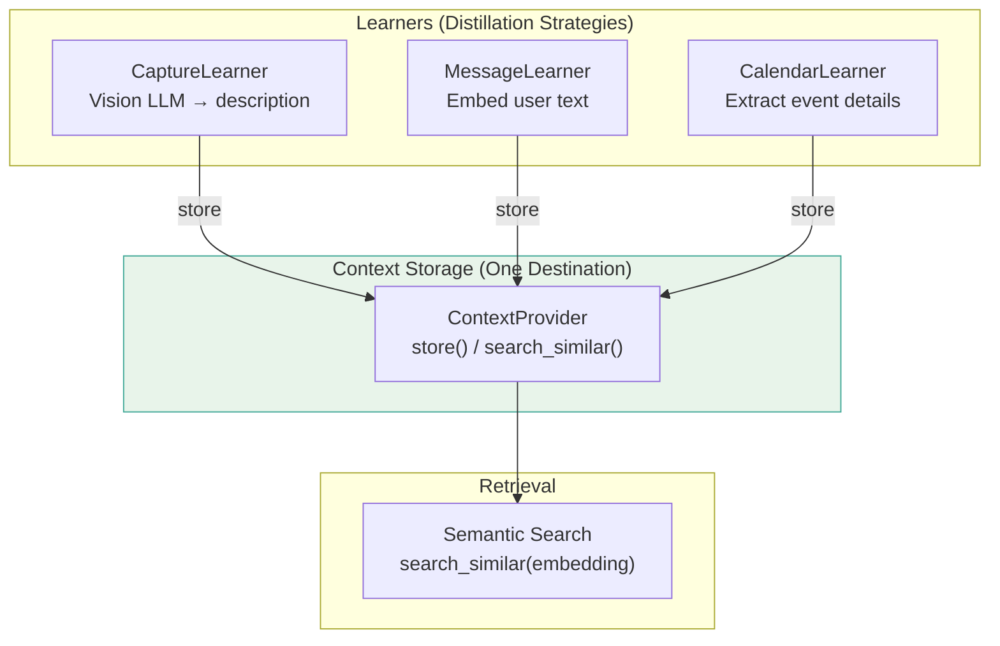
```mermaid
graph TB
    subgraph Learners["Learners (Distillation Strategies)"]
        L1["CaptureLearner<br/>Vision LLM → description"]
        L2["MessageLearner<br/>Embed user text"]
        L3["CalendarLearner<br/>Extract event details"]
    end

    subgraph Storage["Context Storage (One Destination)"]
        CP["ContextProvider<br/>store() / search_similar()"]
    end

    subgraph Retrieval["Retrieval"]
        R["Semantic Search<br/>search_similar(embedding)"]
    end

    L1 -->|store| CP
    L2 -->|store| CP
    L3 -->|store| CP

    CP --> R

    style Storage fill:#e8f4ea,stroke:#4a9
```

**Key insight:** Many learners → one ContextProvider. Learners differ by HOW they distill, not WHERE they store.

### 4.2 The Full Flow

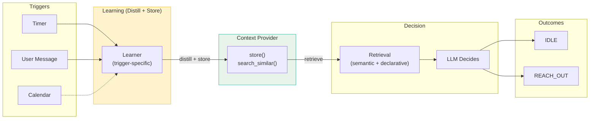
```mermaid
graph LR
    subgraph Triggers["Triggers"]
        T1["Timer"]
        T2["User Message"]
        T3["Calendar"]
    end

    subgraph Learning["Learning (Distill + Store)"]
        L["Learner<br/>(trigger-specific)"]
    end

    subgraph Context["Context Provider"]
        CP["store()<br/>search_similar()"]
    end

    subgraph Decision["Decision"]
        R["Retrieval<br/>(semantic + declarative)"]
        D["LLM Decides"]
    end

    subgraph Outcomes["Outcomes"]
        O1["IDLE"]
        O2["REACH_OUT"]
    end

    T1 --> L
    T2 --> L
    T3 -.-> L

    L -->|distill + store| CP
    CP -->|retrieve| R
    R --> D

    D --> O1
    D --> O2

    style Learning fill:#fff3cd,stroke:#ffc107
    style Context fill:#e8f4ea,stroke:#4a9
```

**Key insight:** Learning pipelines (yellow) are **experimental and decoupled**. How we extract meaning from screenshots vs calendar events vs emails may evolve independently.

### 4.2 Detailed Sequence

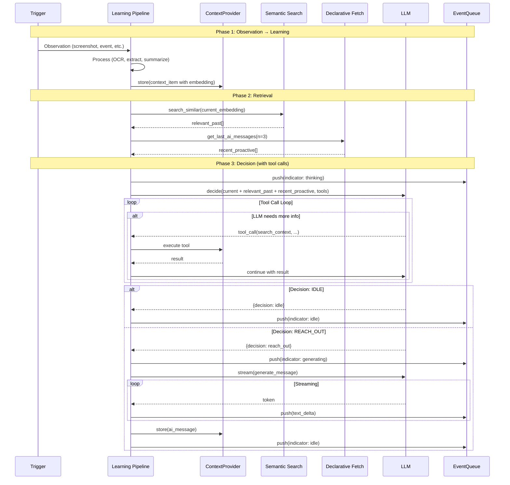
```mermaid
sequenceDiagram
    participant Trigger
    participant Learner as Learning Pipeline
    participant Ctx as ContextProvider
    participant Semantic as Semantic Search
    participant Decl as Declarative Fetch
    participant LLM
    participant Queue as EventQueue

    Note over Trigger,Queue: Phase 1: Observation → Learning
    Trigger->>Learner: Observation (screenshot, event, etc.)
    Learner->>Learner: Process (OCR, extract, summarize)
    Learner->>Ctx: store(context_item with embedding)

    Note over Trigger,Queue: Phase 2: Retrieval
    Learner->>Semantic: search_similar(current_embedding)
    Semantic-->>Learner: relevant_past[]
    Learner->>Decl: get_last_ai_messages(n=3)
    Decl-->>Learner: recent_proactive[]

    Note over Trigger,Queue: Phase 3: Decision (with tool calls)
    Learner->>Queue: push(indicator: thinking)
    Learner->>LLM: decide(current + relevant_past + recent_proactive, tools)

    loop Tool Call Loop
        alt LLM needs more info
            LLM-->>Learner: tool_call(search_context, ...)
            Learner->>Ctx: execute tool
            Ctx-->>Learner: result
            Learner->>LLM: continue with result
        end
    end

    alt Decision: IDLE
        LLM-->>Learner: {decision: idle}
        Learner->>Queue: push(indicator: idle)
    else Decision: REACH_OUT
        LLM-->>Learner: {decision: reach_out}
        Learner->>Queue: push(indicator: generating)
        Learner->>LLM: stream(generate_message)
        loop Streaming
            LLM-->>Learner: token
            Learner->>Queue: push(text_delta)
        end
        Learner->>Ctx: store(ai_message)
        Learner->>Queue: push(indicator: idle)
    end
```

### 4.3 Learning Pipeline Decoupling

Learning pipelines are experimental. Each trigger type may learn differently:

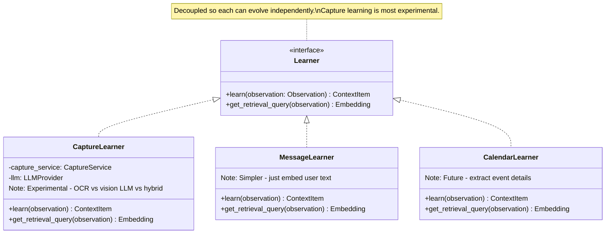
```mermaid
classDiagram
    class Learner {
        <<interface>>
        +learn(observation: Observation) ContextItem
        +get_retrieval_query(observation) Embedding
    }

    class CaptureLearner {
        -capture_service: CaptureService
        -llm: LLMProvider
        +learn(observation) ContextItem
        +get_retrieval_query(observation) Embedding
        Note: Experimental - OCR vs vision LLM vs hybrid
    }

    class MessageLearner {
        +learn(observation) ContextItem
        +get_retrieval_query(observation) Embedding
        Note: Simpler - just embed user text
    }

    class CalendarLearner {
        +learn(observation) ContextItem
        +get_retrieval_query(observation) Embedding
        Note: Future - extract event details
    }

    Learner <|.. CaptureLearner
    Learner <|.. MessageLearner
    Learner <|.. CalendarLearner

    note for Learner "Decoupled so each can evolve independently.\nCapture learning is most experimental."
```

### 4.4 What Gets Retrieved for Decision

| Retrieval Type          | Purpose                                                    | Implementation                                 |
| ----------------------- | ---------------------------------------------------------- | ---------------------------------------------- |
| **Semantic search**     | Cross-trigger continuity ("you were stuck on this before") | `context.search_similar(embedding, limit=10)`  |
| **Last N AI messages**  | Avoid repetition, check if we keep saying the same thing   | `conversation.get_recent_ai_messages(limit=3)` |
| **Active conversation** | If user has replied, we're in a conversation               | `conversation.get_active()`                    |

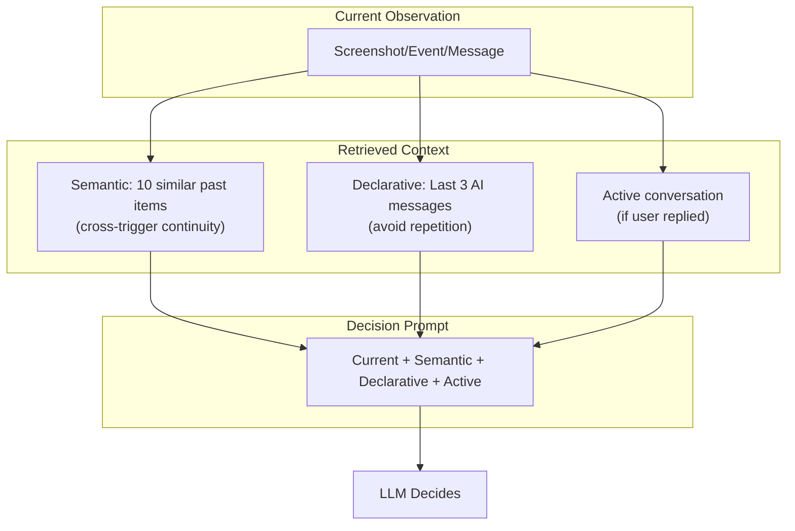
```mermaid
graph TB
    subgraph CurrentObservation["Current Observation"]
        C["Screenshot/Event/Message"]
    end

    subgraph Retrieved["Retrieved Context"]
        S["Semantic: 10 similar past items<br/>(cross-trigger continuity)"]
        D["Declarative: Last 3 AI messages<br/>(avoid repetition)"]
        A["Active conversation<br/>(if user replied)"]
    end

    subgraph Prompt["Decision Prompt"]
        P["Current + Semantic + Declarative + Active"]
    end

    C --> S
    C --> D
    C --> A
    S --> P
    D --> P
    A --> P
    P --> LLM["LLM Decides"]
```

### 4.5 Conversation Lifecycle

An **observation** is NOT a conversation. A **conversation** only exists when user engages.

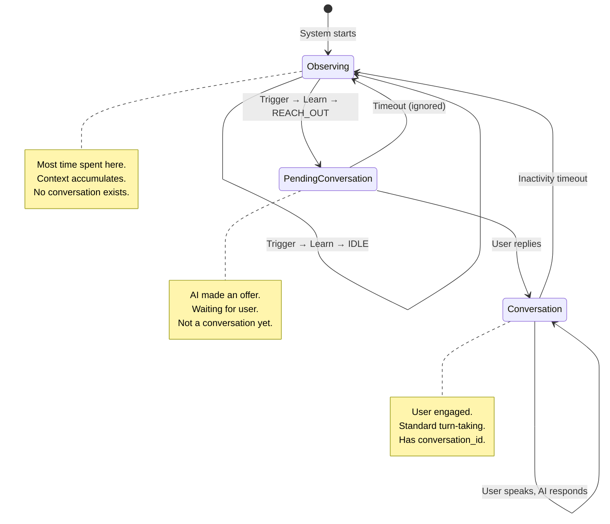
```mermaid
stateDiagram-v2
    [*] --> Observing: System starts

    Observing --> Observing: Trigger → Learn → IDLE
    Observing --> PendingConversation: Trigger → Learn → REACH_OUT

    PendingConversation --> Conversation: User replies
    PendingConversation --> Observing: Timeout (ignored)

    Conversation --> Conversation: User speaks, AI responds
    Conversation --> Observing: Inactivity timeout

    note right of Observing
        Most time spent here.
        Context accumulates.
        No conversation exists.
    end note

    note right of PendingConversation
        AI made an offer.
        Waiting for user.
        Not a conversation yet.
    end note

    note right of Conversation
        User engaged.
        Standard turn-taking.
        Has conversation_id.
    end note
```

### 4.6 User Message Flow (Reply vs Initiated)

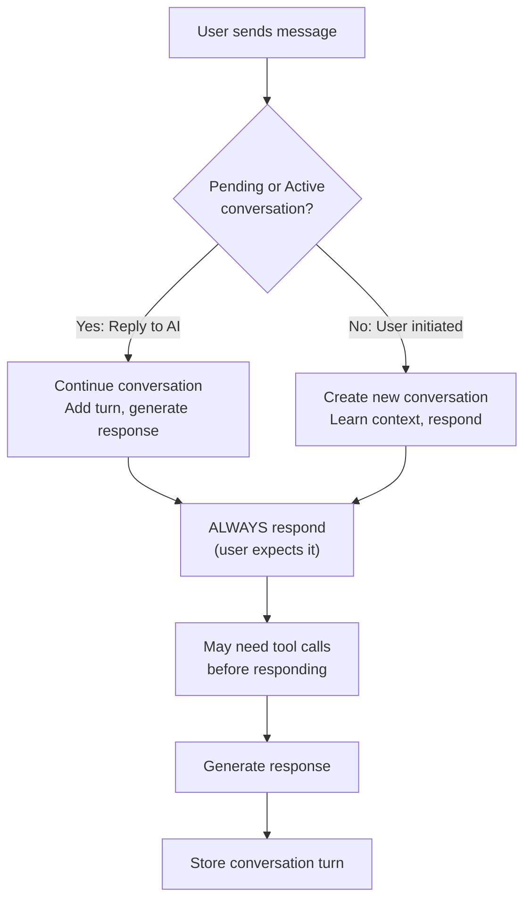
```mermaid
graph TB
    UserMessage["User sends message"]

    UserMessage --> Check{"Pending or Active<br/>conversation?"}

    Check -->|Yes: Reply to AI| Reply["Continue conversation<br/>Add turn, generate response"]
    Check -->|No: User initiated| Initiated["Create new conversation<br/>Learn context, respond"]

    Reply --> AlwaysRespond["ALWAYS respond<br/>(user expects it)"]
    Initiated --> AlwaysRespond

    AlwaysRespond --> MayToolCall["May need tool calls<br/>before responding"]
    MayToolCall --> GenerateResponse["Generate response"]
    GenerateResponse --> StoreTurn["Store conversation turn"]
```

---

## 5. Event System Design

### 5.1 StreamBundle (Unified Event Envelope)

All events share the same structure. Type discrimination is in the JSON payload.

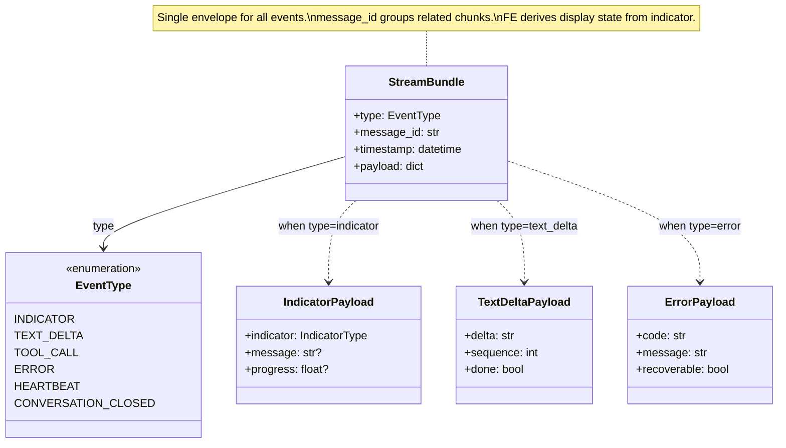
```mermaid
classDiagram
    class StreamBundle {
        +type: EventType
        +message_id: str
        +timestamp: datetime
        +payload: dict
    }

    class EventType {
        <<enumeration>>
        INDICATOR
        TEXT_DELTA
        TOOL_CALL
        ERROR
        HEARTBEAT
        CONVERSATION_CLOSED
    }

    class IndicatorPayload {
        +indicator: IndicatorType
        +message: str?
        +progress: float?
    }

    class TextDeltaPayload {
        +delta: str
        +sequence: int
        +done: bool
    }

    class ErrorPayload {
        +code: str
        +message: str
        +recoverable: bool
    }

    StreamBundle --> EventType : type
    StreamBundle ..> IndicatorPayload : when type=indicator
    StreamBundle ..> TextDeltaPayload : when type=text_delta
    StreamBundle ..> ErrorPayload : when type=error

    note for StreamBundle "Single envelope for all events.\nmessage_id groups related chunks.\nFE derives display state from indicator."
```

### 5.2 Event Flow Through System

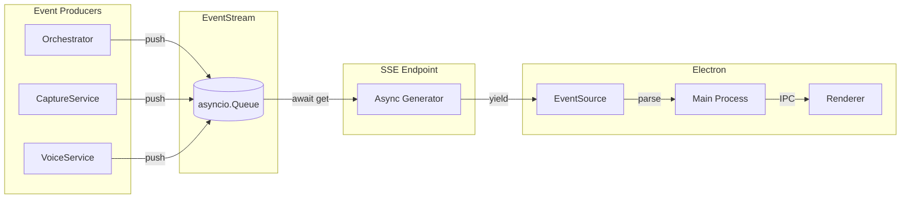
```mermaid
flowchart LR
    subgraph Producers["Event Producers"]
        O[Orchestrator]
        C[CaptureService]
        V[VoiceService]
    end

    subgraph Stream["EventStream"]
        Q[(asyncio.Queue)]
    end

    subgraph Consumer["SSE Endpoint"]
        G[Async Generator]
    end

    subgraph Client["Electron"]
        E[EventSource]
        M[Main Process]
        R[Renderer]
    end

    O -->|push| Q
    C -->|push| Q
    V -->|push| Q

    Q -->|await get| G
    G -->|yield| E
    E -->|parse| M
    M -->|IPC| R
```

### 5.3 Event Wire Format (SSE)

All events use `event: message`. Discrimination is in the JSON `type` field.

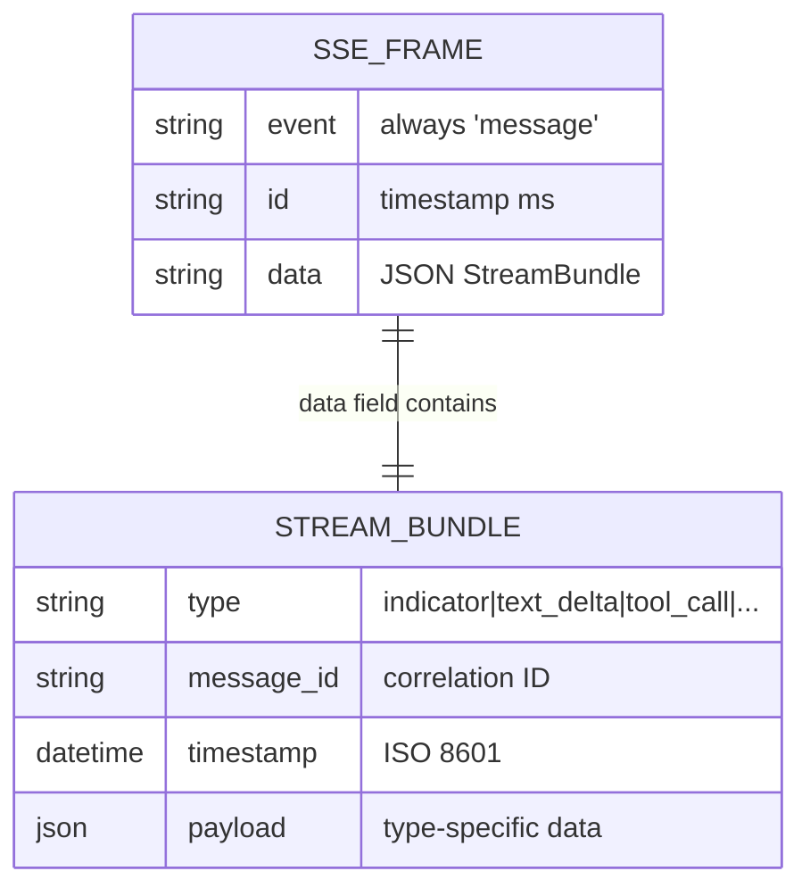
```mermaid
erDiagram
    SSE_FRAME {
        string event "always 'message'"
        string id "timestamp ms"
        string data "JSON StreamBundle"
    }

    STREAM_BUNDLE {
        string type "indicator|text_delta|tool_call|..."
        string message_id "correlation ID"
        datetime timestamp "ISO 8601"
        json payload "type-specific data"
    }

    SSE_FRAME ||--|| STREAM_BUNDLE : "data field contains"
```

---

## 6. Frontend (Electron) Architecture

### 6.1 Electron Process Model

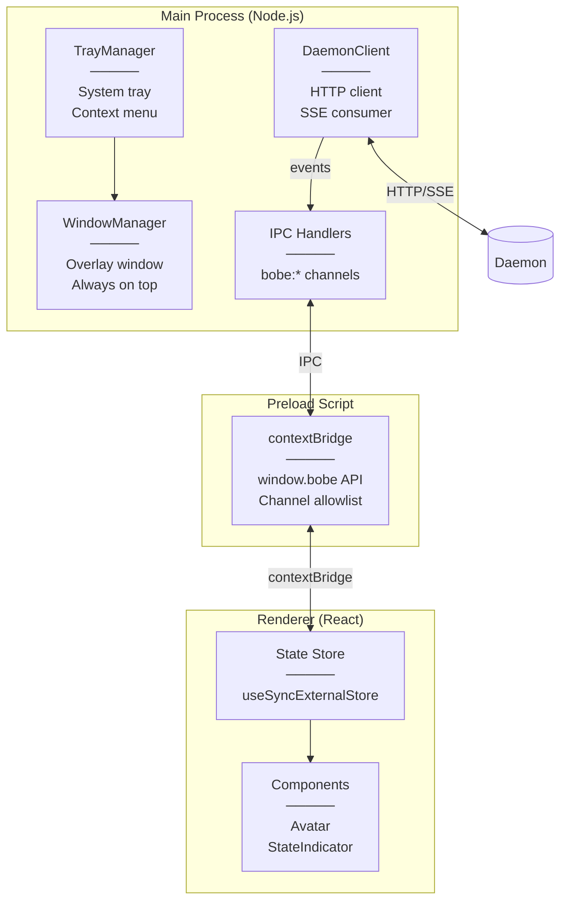
```mermaid
graph TB
    subgraph Main["Main Process (Node.js)"]
        DaemonClient["DaemonClient<br/>─────<br/>HTTP client<br/>SSE consumer"]
        WindowManager["WindowManager<br/>─────<br/>Overlay window<br/>Always on top"]
        TrayManager["TrayManager<br/>─────<br/>System tray<br/>Context menu"]
        IPCHandlers["IPC Handlers<br/>─────<br/>bobe:* channels"]
    end

    subgraph Preload["Preload Script"]
        Bridge["contextBridge<br/>─────<br/>window.bobe API<br/>Channel allowlist"]
    end

    subgraph Renderer["Renderer (React)"]
        Store["State Store<br/>─────<br/>useSyncExternalStore"]
        Components["Components<br/>─────<br/>Avatar<br/>StateIndicator"]
    end

    DaemonClient <-->|HTTP/SSE| Daemon[(Daemon)]
    DaemonClient -->|events| IPCHandlers
    IPCHandlers <-->|IPC| Bridge
    Bridge <-->|contextBridge| Store
    Store --> Components

    TrayManager --> WindowManager
```

### 6.2 DaemonClient (NOT "EventSink")

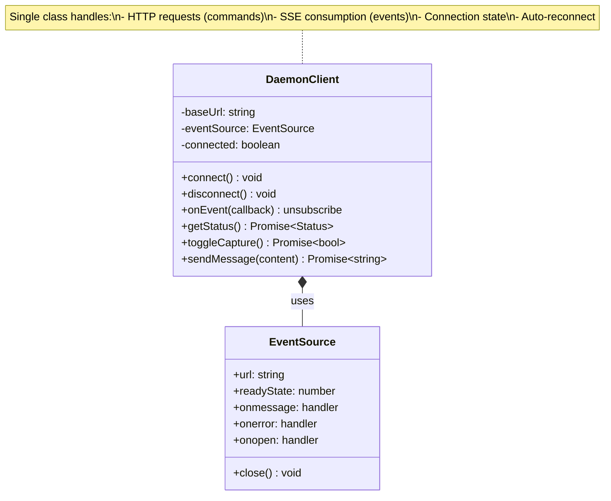
```mermaid
classDiagram
    class DaemonClient {
        -baseUrl: string
        -eventSource: EventSource
        -connected: boolean
        +connect() void
        +disconnect() void
        +onEvent(callback) unsubscribe
        +getStatus() Promise~Status~
        +toggleCapture() Promise~bool~
        +sendMessage(content) Promise~string~
    }

    class EventSource {
        +url: string
        +readyState: number
        +onmessage: handler
        +onerror: handler
        +onopen: handler
        +close() void
    }

    DaemonClient *-- EventSource : uses

    note for DaemonClient "Single class handles:\n- HTTP requests (commands)\n- SSE consumption (events)\n- Connection state\n- Auto-reconnect"
```

### 6.3 Startup Sequence

```mermaid
sequenceDiagram
    participant U as User
    participant E as Electron Main
    participant D as Daemon
    participant R as Renderer

    U->>E: Launch app

    rect rgb(255, 240, 240)
        Note over E,D: Health Check Loop
        E->>D: GET /status
        alt Daemon not running
            E->>E: Spawn daemon subprocess
            loop Until healthy
                E->>D: GET /status
                D-->>E: 503 (starting)
            end
        end
        D-->>E: 200 OK
    end

    rect rgb(240, 255, 240)
        Note over E,D: Establish SSE
        E->>D: GET /events
        D-->>E: 200 OK (SSE stream begins)
        D-->>E: event: message {type: "indicator", payload: {indicator: "idle"}}
    end

    rect rgb(240, 240, 255)
        Note over E,R: Create Window
        E->>E: Create overlay window
        E->>R: Load index.html
        R->>R: React mounts
        R->>E: IPC: bobe:get-state
        E-->>R: {state: "idle", connected: true}
        R->>R: Render Avatar (idle state)
    end

    U->>R: Sees overlay appear
```

### 6.4 Reconnection Logic

```mermaid
stateDiagram-v2
    [*] --> Disconnected

    Disconnected --> Connecting: connect()
    Connecting --> Connected: SSE open event
    Connecting --> Disconnected: timeout/error

    Connected --> Reconnecting: SSE error/close

    Reconnecting --> Connected: SSE open event
    Reconnecting --> Reconnecting: retry with backoff
    Reconnecting --> Disconnected: max retries exceeded

    Connected --> Disconnected: explicit disconnect()

    note right of Reconnecting
        Exponential backoff:
        1s → 2s → 4s → 8s → max 30s

        On reconnect:
        - Send Last-Event-ID header
        - Re-sync state via GET /status
    end note
```

---

## 7. Data Models & Schemas

### 7.1 Core Domain Types

```mermaid
classDiagram
    class AIMessage {
        +role: "system"|"user"|"assistant"|"tool"
        +content: str
        +tool_calls: list~AIToolCall~
        +tool_call_id: str?
    }

    class AIToolCall {
        +id: str
        +name: str
        +arguments: dict
    }

    class AIResponse {
        +message: AIMessage
        +finish_reason: str
        +usage: TokenUsage?
    }

    class StreamChunk {
        +delta: str
        +tool_calls: list~AIToolCall~
        +finish_reason: str?
    }

    AIResponse *-- AIMessage
    AIMessage *-- AIToolCall
```

### 7.2 Context Types

```mermaid
classDiagram
    class ContextItem {
        +id: str
        +created_at: datetime
        +source: "screenshot"|"audio"|"clipboard"
        +content: str
        +summary: str?
        +category: str
        +importance: float
        +embedding: list~float~?
    }

    class ContextSearchResult {
        +item: ContextItem
        +score: float
        +highlights: list~str~
    }

    ContextSearchResult *-- ContextItem
```

### 7.3 StreamBundle (Domain Type)

```mermaid
classDiagram
    class StreamBundle {
        +type: EventType
        +message_id: str
        +timestamp: datetime
        +payload: dict
        +to_json() dict
    }

    class EventType {
        <<enumeration>>
        INDICATOR
        TEXT_DELTA
        TOOL_CALL
        ERROR
        HEARTBEAT
        CONVERSATION_CLOSED
    }

    class IndicatorType {
        <<enumeration>>
        IDLE
        CAPTURING
        ANALYZING
        THINKING
        GENERATING
        SPEAKING
    }

    StreamBundle --> EventType
    StreamBundle ..> IndicatorType : "payload.indicator when type=INDICATOR"

    note for StreamBundle "Single envelope for all events.\nNo separate ControlEvent/StreamEvent.\nFE derives display state from indicator."
```

---

## 8. Timing & Lifecycle

### 8.1 Proactive Message Timeline

```mermaid
gantt
    title Proactive Message Generation Timeline
    dateFormat ss
    axisFormat %S

    section Capture
    Screenshot          :cap, 00, 1s
    OCR Extraction      :ocr, after cap, 1s

    section Analysis
    Vision LLM          :vis, after ocr, 3s
    Context Storage     :store, after vis, 0.5s

    section Decision
    Get Recent Context  :ctx, after store, 0.5s
    Decision LLM        :dec, after ctx, 2s

    section Generation
    Generate Message    :gen, after dec, 4s
    TTS (if enabled)    :tts, after gen, 3s
```

### 8.2 Event Timing

```mermaid
sequenceDiagram
    participant D as Daemon
    participant E as Electron

    Note over D,E: Heartbeat keeps connection alive
    loop Every 30s
        D-->>E: event: heartbeat
    end

    Note over D,E: Indicator changes are instant
    D-->>E: event: message {type:"indicator", payload:{indicator:"thinking"}}
    Note over E: FE derives state, ~10ms to render

    Note over D,E: Text streams token by token
    loop ~50 tokens
        D-->>E: event: message {type:"text_delta", payload:{delta:"word ", sequence:N}}
        Note over E: ~5ms per token to append
    end
    D-->>E: event: message {type:"text_delta", payload:{done:true}}
```

---

## 9. Dependency Injection

### 9.1 Container Structure

```mermaid
graph TB
    subgraph Container["ProviderContainer"]
        Config["AppConfig"]

        LLM["LLMProvider"]
        Context["ContextProvider"]
        Tools["ToolProvider"]
        Embedding["EmbeddingProvider"]
        EventStream["EventStream"]
    end

    subgraph Created["Created at Startup"]
        Factory["ProviderFactory"]
    end

    subgraph Injected["Injected Into"]
        Orchestrator
        API["API Routes"]
    end

    Config --> Factory
    Factory --> Container
    Container --> Injected
```

### 9.2 Litestar Dependency Injection

```mermaid
sequenceDiagram
    participant App as Litestar App
    participant DI as DI Container
    participant Route as Route Handler
    participant Orch as Orchestrator

    Note over App,Orch: Application Startup
    App->>DI: Register providers
    DI->>DI: Create LLMProvider
    DI->>DI: Create ContextProvider
    DI->>DI: Create Orchestrator(llm, context)

    Note over App,Orch: Request Handling
    Route->>DI: Request Orchestrator
    DI-->>Route: Singleton instance
    Route->>Orch: run_decision_loop()
```

---

## 10. Error Handling & Recovery

### 10.1 Error Flow

```mermaid
flowchart TD
    subgraph Errors["Error Types"]
        LLMError["LLM Unavailable"]
        DBError["Database Error"]
        CaptureError["Capture Failed"]
    end

    subgraph Handling["Error Handling"]
        Retry["Retry with backoff"]
        Fallback["Use fallback"]
        Notify["Notify user"]
        Log["Log & continue"]
    end

    subgraph Recovery["Recovery Actions"]
        Reconnect["Reconnect to LLM"]
        UseCloud["Fall back to cloud"]
        SkipCapture["Skip this capture"]
    end

    LLMError --> Retry
    Retry --> Reconnect
    Reconnect -->|Still failing| Fallback
    Fallback --> UseCloud

    DBError --> Log
    Log --> Notify

    CaptureError --> SkipCapture
    SkipCapture --> Log
```

### 10.2 Graceful Degradation

```mermaid
graph LR
    subgraph Normal["Normal Operation"]
        Local["Local LLM"]
        LocalSTT["Local Whisper"]
        LocalTTS["Local Piper"]
    end

    subgraph Degraded["Degraded Mode"]
        Cloud["Cloud LLM"]
        NoSTT["STT Disabled"]
        NoTTS["TTS Disabled"]
    end

    subgraph Minimal["Minimal Mode"]
        NoLLM["LLM Unavailable"]
        Capture["Capture Only"]
    end

    Local -->|Failed| Cloud
    Cloud -->|Failed| NoLLM

    LocalSTT -->|Failed| NoSTT
    LocalTTS -->|Failed| NoTTS

    NoLLM --> Capture
```
